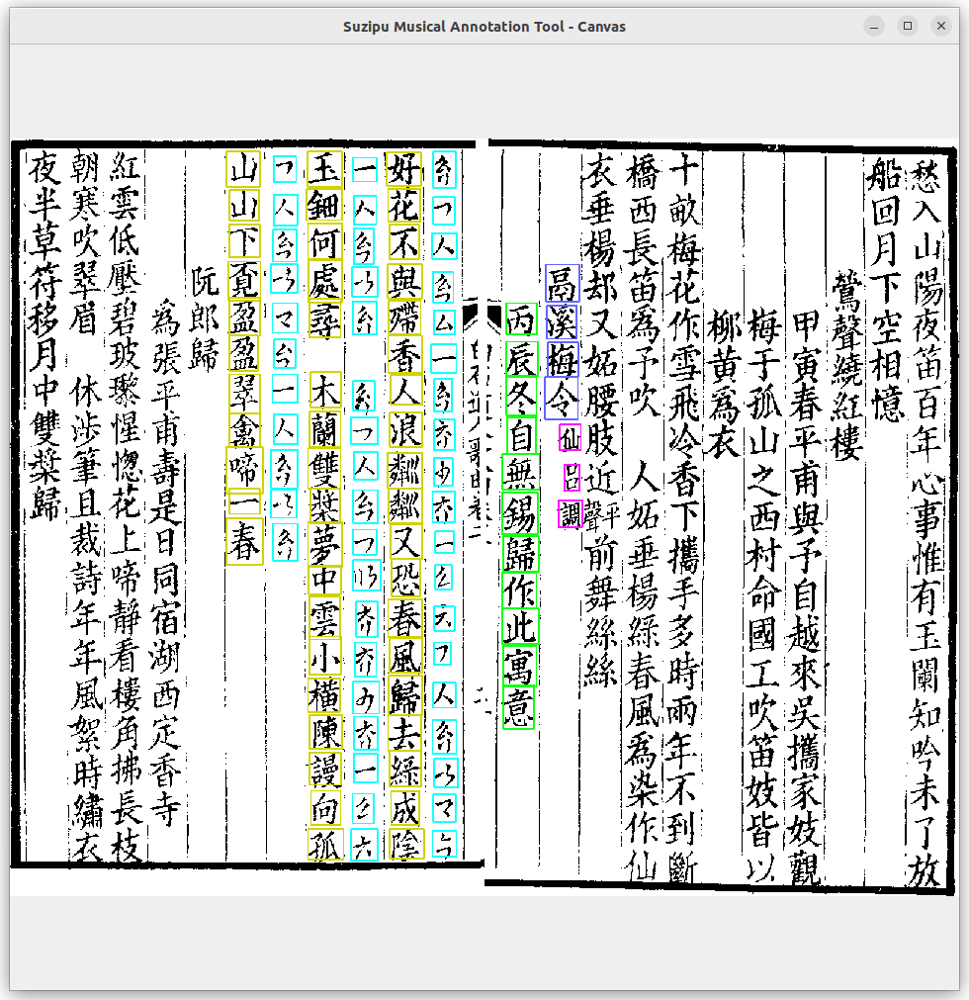
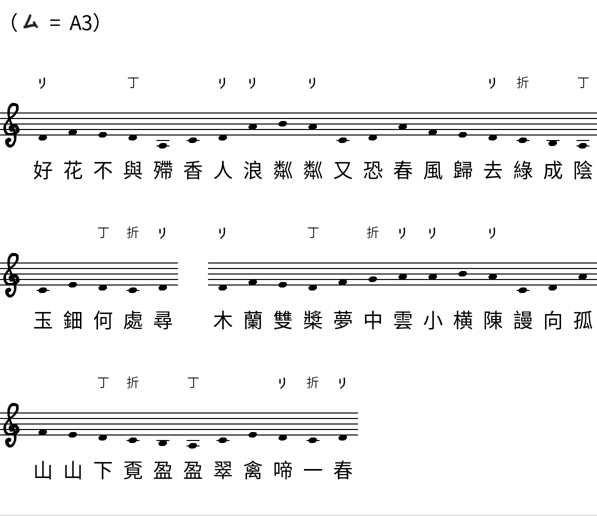
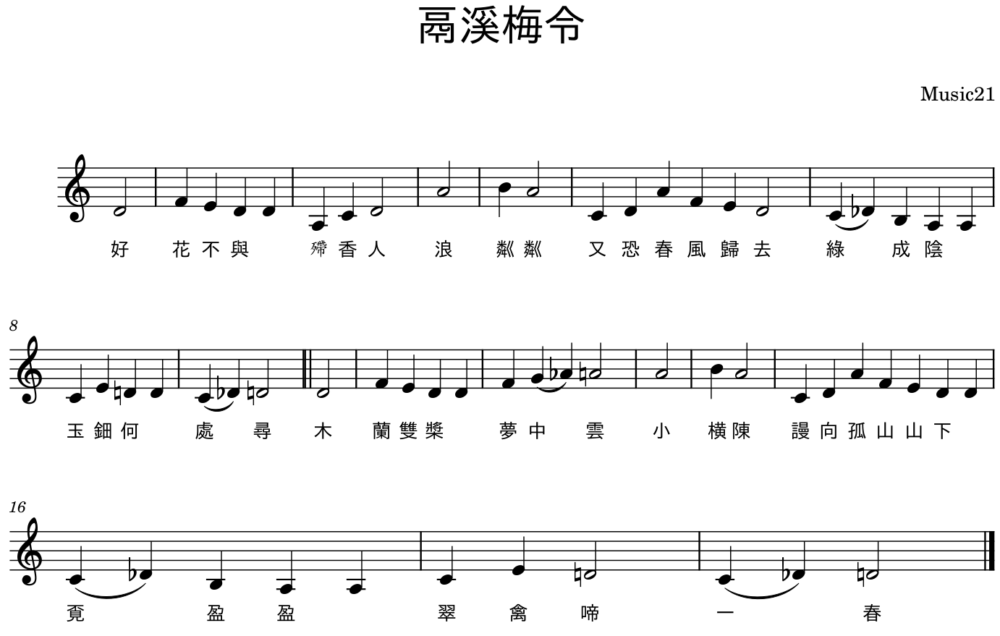

## SuziAI project

Welcome to the SuziAI project, a collection of repositories targeting digitization and AI methods for ancient Chinese
*suzipu* 俗字谱 notation.

*Suzipu* notation (literal translation: common character notation), also called *banzipu* 半字谱 notation (literal
translation: half character notation) is a notation which was predominantly used in Song dynasty in China (960–1279).
In addition, the notation is still used in the actively performed music tradition of *Xi'an Guyue* 西安鼓乐。

The largest historical source of music written in *suzipu* notation is *Baishidaoren Gequ* 白石道人歌曲 by *Jiang Kui*
姜夔, a collection of poetry firstly published in 1202.

### Goal

The goal of SuziAI is to promote the preservation and understanding of cultural heritage through digitization. This is
achieved by conducting research about *suzipu* notation using digitization and methods of artificial intelligence
(AI) in several different aspects:

1. Creating digital machine-readable representations of *suzipu* notation.
2. Toolboxes for creating digitally represented music written in *suzipu*, e.g., via annotation or notation editor software.
3. Development of AI tools involving *suzipu* notation or its music.

### Subprojects

#### Current Subprojects
The subprojects currently associated with SuziAI are:
1. [gui-tools](https://github.com/SuziAI/gui-tools): The digital representation of *suzipu* notation and the annotation
   tool for creating databases suitable for the development of OMR techniques.

#### Future Subprojects
2. SuziCORPUS: A digital machine-readable corpus of both purely symbolic and OMR-oriented representations of the 17
   *suzipu* pieces from *Baishidaoren Gequ*.
3. SuziOMR: The development of deep learning algorithms for optical music recognition (OMR) of *suzipu* notation.
4. SuziGEN: The style-based generation of melodies to *ci* 词 poetry in *suzipu* notation.

